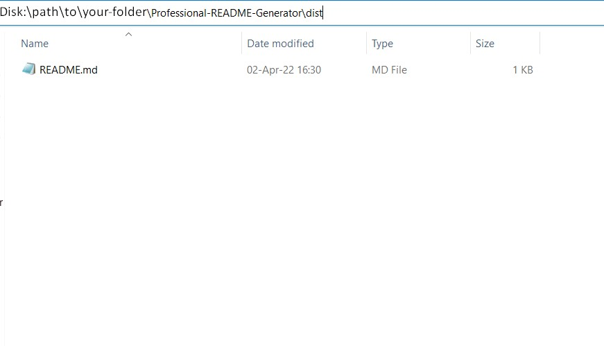
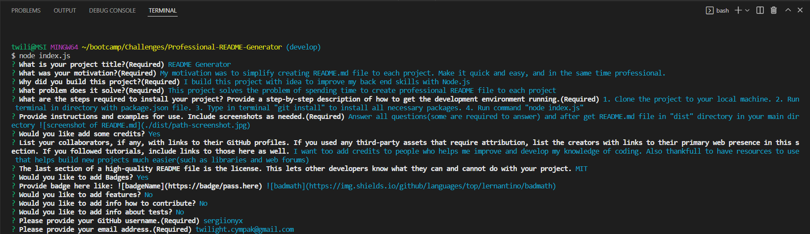

# Professioanl README Generator

## Description
- My motivation was to simplify creating README.md file to each project. Make it quick and easy, and in the same time professional.
- I build this project with idea to improve my back end skills with Node.js
- This project solves the problem of spending time to create professional README file to each project
- I learned how to interact with user via terminal and then use obtained input to build file.

## Table of Contents

- [Installation](#installation)
- [Usage](#usage)
- [Credits](#credits)
- [License](#license)

## Installation

Clone the project to your local machine. Run terminal in directory with package.json file. Type in terminal "git install" to install all necessary packages. Run command "node index.js".

## Usage

Answer all questions(some are required to answer) and after get README.md file in "dist" directory in your main directory

(./src/video-of-usage-README-Generator.gif)

## Credits

I want too add credits to people who helps me improve and develop my knowledge of coding. Also thankfull to have resources to use that helps build new projects much easier(such as libraries and web forums).
## License

[Link to license: MIT](https://opensource.org/licenses/MIT)
## Badges

## Questions

Here is link to my GitHub profile page: https://github.com/sergiionyx

And also you may contact me via e-mail: twilight.cympak@gmail.com
